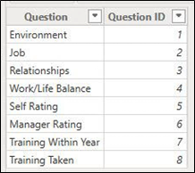
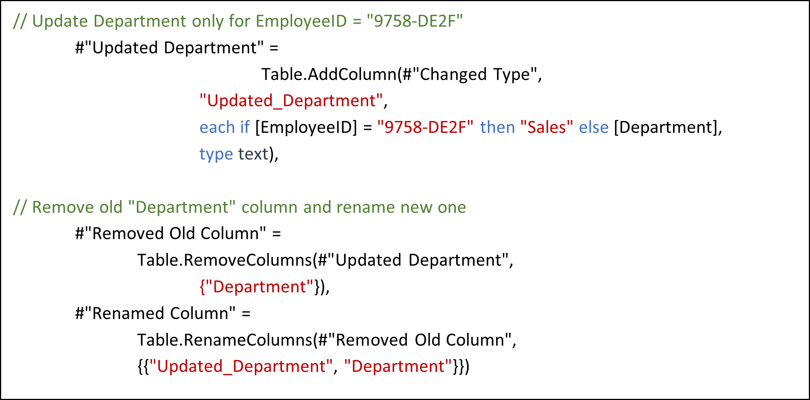
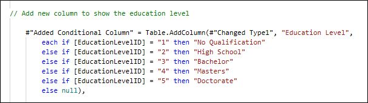

# Egypt's digital pioneers' initiative  
**"Final Project Documentation"**  


---

## **Project:**  
**Human Resources Dataset Analysis**  
**Google Data Analyst Specialist**  
**ONL2_DAT1_G2**  
**Storytellers Team**  

---

## **Acknowledgement**  
> As a team of students from the Egypt's Digital Pioneers Initiative, we would like to extend our deepest gratitude to all those who made this initiative possible. This remarkable program stands as a testament to Egypt's commitment to digital transformation and the strengthening of its national economy, under the generous sponsorship of the Ministry of Communications and Information Technology.  
>  
> We are sincerely thankful for this invaluable training opportunity, provided free of charge, which has greatly enriched our knowledge and skills. We are also deeply appreciative of the fortune that allowed us to be part of this initiative and to benefit from its extensive resources.  
>  
> We would also like to express our heartfelt thanks to all the training partners and companies who played a vital role in delivering high-quality training throughout this journey. Special thanks go to the esteemed and dedicated trainers who guided us through this enriching experience over the past six months. Their expertise, commitment, and support have truly inspired us and made this journey both enlightening and enjoyable.  
>  
> With that, we are honored to present this humble work as a culmination of our learning journey. We hope it meets your expectations and reflects the effort and dedication we have invested throughout this incredible experience.  

---

## **Executive Summary**  
This HR Data Analysis Project aims to provide insights into the workforce dynamics, employee qualifications, and organizational efficiency by leveraging data-driven decision-making. The dataset encompasses personal employee details, business details, and employees feedback collected throughout their work periods.  

By analyzing these data points, we seek to: tools for deep insights of workforce, uncover trends, strengths, and areas for improvement across various aspects of the employee lifecycle.  

Through comprehensive analysis, we will identify key drivers of employee engagement, performance, and retention, offering strategic recommendations to enhance HR policies, talent management, and overall business performance. The findings from this study will support informed executive decision-making, ensuring alignment between workforce well-being and organizational objectives.  

---

## **Project Objectives**  
1. **Analyze Workforce Demographics & Distribution**  
   - Understand employee distribution across branches, roles, and qualifications.  
   - Identify patterns in workforce diversity, tenure, and career progression.  

2. **Analyze Salary Pattern in the organization**  

3. **Evaluate Employee Satisfaction & Work Experience**  
   - Assess employee perceptions of their jobs, work environment, relationships, and the life/work balance.  
   - Detect trends in employee engagement and dissatisfaction over time.  

4. **Measure Leadership & Managerial Effectiveness**  
   - Examine employees' ratings of managers and leadership impact.  
   - Identify leadership strengths and areas requiring improvement.  

5. **Identify Factors Influencing Retention & Turnover**  
   - Analyze historical survey responses to determine predictors of employee attrition.  
   - Provide data-driven recommendations for improving retention strategies.  

6. **Deliver actionable insights to Optimize HR Strategies & Policies**  

By addressing these objectives, this project will serve as a strategic tool for enhancing employee engagement, improving managerial effectiveness, and fostering a productive and satisfied workforce.  

---

## **Data Cleaning & Modeling**  
Here are the detailed steps performed to the dataset in order to build up the desired analysis report.  

### **Table: Performance Rating**  
1. Rename columns:  
   - PerformanceID → Survey ID  
   - EmployeeID → Employee ID  
   - ReviewDate → Review Date  
   - EnvironmentSatisfaction → Environment  
   - JobSatisfaction → Job  
   - RelationshipSatisfaction → Relationships  
   - TrainingOpportunitiesWithinYear → Training Within Year  
   - TrainingOpportunitiesTaken → Training Taken  
   - WorkLifeBalance → Work/Life Balance  

2. Unpivot the survey questions columns: (Environment -- Job -- Relationships - Training Within Year - Training Taken - Work/Life Balance).  

3. Rename the resulted 2 columns to (question) & (answer).  

4. Separate the (question) column in a new table, by Create new query for the (question) column, rename the column, convert the query into a table and rename it (Questions).  

5. Rename the old table to (Survey).  

  

6. Add an index column to the table (Questions) and rename the column to (question ID).  

7. Relate between the tables (Survey) and (Questions) by merge the tables to get the column (question id) in (Survey) then deletes the column (question) from it.  
   These steps will help in visualizing the surveys results according to the answers' ratings.  

### **Table: Rating Level & Satisfied Level**  
1. We will use Classes listed in these tables directly in charts options and DAX.  
2. Delete both tables.  

### **Table: Employee**  
1. Ensure that years in most recent role <= years in company.  

2. Correction of the cell value related to employee ID: (9758-DE2F), where the department was mistakenly assigned as (Technology), despite the employee's job role being (Sales Executive). The department updated to (Sales).  
   The M language code for this modification in power query Includes adding a new column with the value to be modified, then removing the original (department) column, and finally rename the new one, as below:  

```m
// Update Department only for EmployeeID = "9758-DE2F"
#"Updated Department" =
Table.AddColumn(#"Changed Type",
    "Updated_Department",
    each if [EmployeeID] = "9758-DE2F" then "Sales" else [Department],
    type text),

// Remove old "Department" column and rename new one
#"Removed Old Column" =
    Table.RemoveColumns(#"Updated Department",
    {"Department"}),

#"Renamed Column" =
    Table.RenameColumns(#"Removed Old Column",
    {{"Updated_Department", "Department"}}).
```
## Rename column (Education) to (EducationLevelID) and change type to text.



Add new conditional column (Education Level) using the attributes from table (EducationLevel) and change type to text.

Change Values of Column (Ethnicity):

Asian or Asian American → Asian/Asian American

Black or African American → Black/African American

Native Hawaiian → Hawaiian

Mixed or multiple ethnic groups → Mixed-ethnic groups

American Indian or Alaska Native → American Indian/Alaska



Add new conditional column (Age Category) and change type to text.

Replace values in column (Attrition) as follows:

Yes → Departed

No → Active

Rename columns to enhance visibility.

In Table view:

Modify column (Salary) format to currency

Sort the column (EducationLevel) by the column (EducationLevelID).

In Model View:
Dividing the table into 2 folders:

(Personal) which includes all personal columns for each employee.

(Professional) which includes all work columns for each employee.
