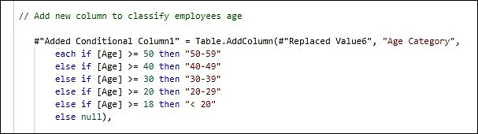
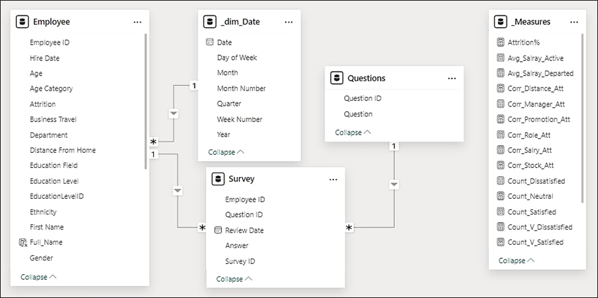

# Egypt's digital pioneers' initiative  
**"Final Project Documentation"**  


---

## **Project:**  
**Human Resources Dataset Analysis**  
**Google Data Analyst Specialist**  
**ONL2_DAT1_G2**  
**Storytellers Team**  

---

## **Acknowledgement**  
> As a team of students from the Egypt's Digital Pioneers Initiative, we would like to extend our deepest gratitude to all those who made this initiative possible. This remarkable program stands as a testament to Egypt's commitment to digital transformation and the strengthening of its national economy, under the generous sponsorship of the Ministry of Communications and Information Technology.  
>  
> We are sincerely thankful for this invaluable training opportunity, provided free of charge, which has greatly enriched our knowledge and skills. We are also deeply appreciative of the fortune that allowed us to be part of this initiative and to benefit from its extensive resources.  
>  
> We would also like to express our heartfelt thanks to all the training partners and companies who played a vital role in delivering high-quality training throughout this journey. Special thanks go to the esteemed and dedicated trainers who guided us through this enriching experience over the past six months. Their expertise, commitment, and support have truly inspired us and made this journey both enlightening and enjoyable.  
>  
> With that, we are honored to present this humble work as a culmination of our learning journey. We hope it meets your expectations and reflects the effort and dedication we have invested throughout this incredible experience.  

---

## **Executive Summary**  
This HR Data Analysis Project aims to provide insights into the workforce dynamics, employee qualifications, and organizational efficiency by leveraging data-driven decision-making. The dataset encompasses personal employee details, business details, and employees feedback collected throughout their work periods.  

By analyzing these data points, we seek to: tools for deep insights of workforce, uncover trends, strengths, and areas for improvement across various aspects of the employee lifecycle.  

Through comprehensive analysis, we will identify key drivers of employee engagement, performance, and retention, offering strategic recommendations to enhance HR policies, talent management, and overall business performance. The findings from this study will support informed executive decision-making, ensuring alignment between workforce well-being and organizational objectives.  

---

## **Project Objectives**  
1. **Analyze Workforce Demographics & Distribution**  
   - Understand employee distribution across branches, roles, and qualifications.  
   - Identify patterns in workforce diversity, tenure, and career progression.  

2. **Analyze Salary Pattern in the organization**  

3. **Evaluate Employee Satisfaction & Work Experience**  
   - Assess employee perceptions of their jobs, work environment, relationships, and the life/work balance.  
   - Detect trends in employee engagement and dissatisfaction over time.  

4. **Measure Leadership & Managerial Effectiveness**  
   - Examine employees' ratings of managers and leadership impact.  
   - Identify leadership strengths and areas requiring improvement.  

5. **Identify Factors Influencing Retention & Turnover**  
   - Analyze historical survey responses to determine predictors of employee attrition.  
   - Provide data-driven recommendations for improving retention strategies.  

6. **Deliver actionable insights to Optimize HR Strategies & Policies**  

By addressing these objectives, this project will serve as a strategic tool for enhancing employee engagement, improving managerial effectiveness, and fostering a productive and satisfied workforce.  

---

## **Data Cleaning & Modeling**  
Here are the detailed steps performed to the dataset in order to build up the desired analysis report.  

### **Table: Performance Rating**  
1. Rename columns:  
   - PerformanceID → Survey ID  
   - EmployeeID → Employee ID  
   - ReviewDate → Review Date  
   - EnvironmentSatisfaction → Environment  
   - JobSatisfaction → Job  
   - RelationshipSatisfaction → Relationships  
   - TrainingOpportunitiesWithinYear → Training Within Year  
   - TrainingOpportunitiesTaken → Training Taken  
   - WorkLifeBalance → Work/Life Balance  

2. Unpivot the survey questions columns: (Environment -- Job -- Relationships - Training Within Year - Training Taken - Work/Life Balance).  

3. Rename the resulted 2 columns to (question) & (answer).  

4. Separate the (question) column in a new table, by Create new query for the (question) column, rename the column, convert the query into a table and rename it (Questions).  

5. Rename the old table to (Survey).  

  

6. Add an index column to the table (Questions) and rename the column to (question ID).  

7. Relate between the tables (Survey) and (Questions) by merge the tables to get the column (question id) in (Survey) then deletes the column (question) from it.  
   These steps will help in visualizing the surveys results according to the answers' ratings.  

### **Table: Rating Level & Satisfied Level**  
1. We will use Classes listed in these tables directly in charts options and DAX.  
2. Delete both tables.  

### **Table: Employee**  
1. Ensure that years in most recent role <= years in company.  

2. Correction of the cell value related to employee ID: (9758-DE2F), where the department was mistakenly assigned as (Technology), despite the employee's job role being (Sales Executive). The department updated to (Sales).  
   The M language code for this modification in power query Includes adding a new column with the value to be modified, then removing the original (department) column, and finally rename the new one, as below:  

```m
// Update Department only for EmployeeID = "9758-DE2F"
#"Updated Department" =
Table.AddColumn(#"Changed Type",
    "Updated_Department",
    each if [EmployeeID] = "9758-DE2F" then "Sales" else [Department],
    type text),

// Remove old "Department" column and rename new one
#"Removed Old Column" =
    Table.RemoveColumns(#"Updated Department",
    {"Department"}),

#"Renamed Column" =
    Table.RenameColumns(#"Removed Old Column",
    {{"Updated_Department", "Department"}}).
```
3. Rename column (Education) to (EducationLevelID) and change type to text.


4. Add new conditional column (Education Level) using the attributes from table (EducationLevel) and change type to text.


5. Change Values of Column (Ethnicity):

   - Asian or Asian American → Asian/Asian American
   - Black or African American → Black/African American
   - Native Hawaiian → Hawaiian
   - Mixed or multiple ethnic groups → Mixed-ethnic groups
   - American Indian or Alaska Native → American Indian/Alaska


6. Add new conditional column (Age Category) and change type to text.


7. Replace values in column (Attrition) as follows:

   - Yes → Departed
   - No → Active

8. Rename columns to enhance visibility.

9. In Table view:
   - Modify column (Salary) format to currency.
   - Sort the column (EducationLevel) by the column (EducationLevelID).

10. In Model View:
    - Divide the table into 2 folders:
      - **Personal**: Includes all personal columns for each employee.
      - **Professional**: Includes all work columns for each employee.
Table: Education Level
Delete Table.

## The Data Model

### Schema


### Tables

| Name                                   | Description                                                   | Expression                                      | IsHidden | IsPrivate |
|----------------------------------------|---------------------------------------------------------------|------------------------------------------------|----------|-----------|
| Employee                               | Table contains all the information about each employee in the company |                                                | FALSE    | FALSE     |
| Survey                                 | Table contains all the surveys results of all the employees of all time |                                                | FALSE    | FALSE     |
| Questions                              | Table to store and code the questions of the employees' surveys |                                                | FALSE    | FALSE     |
| _Measures                              | Table to store and organize DAX measures                      |                                                | FALSE    | FALSE     |
| _dim_Date                              | Time Table for the analysis period of time                    |                                                | FALSE    | FALSE     |
| DateTableTemplate_4439d23f-be47-4c76-af94-b88c07a4e1c1 | Calendar(Date(2015,1,1), Date(2015,1,1))                      | TRUE                                           | TRUE     |
| LocalDateTable_eb61007b-a943-48b9-a0bd-3a3586bec2b3 | Calendar(Date(Year(MIN('_dim_Date'[Date])), 1, 1), Date(Year(MAX('_dim_Date'[Date])), 12, 31)) | TRUE                                           | FALSE    |
| LocalDateTable_ffda792a-e4e2-4437-b266-0a08d4d4f59a | Calendar(Date(Year(MIN('Survey'[Review Date])), 1, 1), Date(Year(MAX('Survey'[Review Date])), 12, 31)) | TRUE                                           | FALSE    |
| Model_Columns                          | INFO.VIEW.COLUMNS()                                           |                                                | FALSE    | FALSE     |
| Model_Measures                         | INFO.VIEW.MEASURES()                                          |                                                | FALSE    | FALSE     |
| Model_Relationships                    | INFO.VIEW.RELATIONSHIPS()                                     |                                                | FALSE    | FALSE     |
| Model_Tables                           | INFO.VIEW.TABLES()                                            |                                                | FALSE    | FALSE     |


More detailed (.csv) files of the Model components are attached with this documentation.  
Additionally, detailed tables of components (Tables, Columns, Relationships, Measures) are included as hidden pages in the Power BI project report file.

## DAX Measures

**DAX**


<table><tr><th colspan="2"><b>Name</b></th><th colspan="1"><b>Code & Description</b></th></tr>
<tr><td colspan="1" rowspan="2" valign="top">01</td><td colspan="1" rowspan="2" valign="top">Full_Name</td><td colspan="1" valign="top">Retrieve the full name of the employee</td></tr>
<tr><td colspan="1" valign="top">`    `Full_Name = Employee[First Name] & " " & Employee[Last Name]</td></tr>
<tr><td colspan="1" rowspan="2" valign="top">02</td><td colspan="1" rowspan="2" valign="top">Emp_Total</td><td colspan="1" valign="top">Retrieve the total number of employees</td></tr>
<tr><td colspan="1" valign="top">`    `Emp_Total = CALCULATE(DISTINCTCOUNT(Employee[Employee ID]))</td></tr>
<tr><td colspan="1" rowspan="2" valign="top">03</td><td colspan="1" rowspan="2" valign="top">Emp_Active</td><td colspan="1" valign="top">Retrieve the total number of employees that still work at the company</td></tr>
<tr><td colspan="1" valign="top"><p>`    `Emp_Active = CALCULATE(</p><p>`        `[Emp_Total],</p><p>`        `Employee[Attrition] = "active"</p><p>`    `)</p></td></tr>
<tr><td colspan="1" rowspan="2" valign="top">04</td><td colspan="1" rowspan="2" valign="top">Emp_Departed</td><td colspan="1" valign="top">Retrieve the total number of employees that left the company</td></tr>
<tr><td colspan="1" valign="top"><p>`    `Emp_Departed = COALESCE(</p><p>`        `CALCULATE(</p><p>`            `[Emp_Total],</p><p>`            `Employee[Attrition] = "Departed"</p><p>`        `),</p><p>`        `0</p><p>`    `)</p></td></tr>
<tr><td colspan="1" rowspan="2" valign="top">05</td><td colspan="1" rowspan="2" valign="top">Emp_Hired</td><td colspan="1" valign="top">Retrieve the total number of employees that have been hired</td></tr>
<tr><td colspan="1" valign="top">`    `Emp_Hired = [Emp_Active] + [Emp_Departed]</td></tr>
<tr><td colspan="1" rowspan="2" valign="top">06</td><td colspan="1" rowspan="2" valign="top">Attrition%</td><td colspan="1" valign="top">Retrieve the percentage of departed employees to the total</td></tr>
<tr><td colspan="1" valign="top">`    `Attrition% = [Emp_Departed]/([Emp_Departed]+[Emp_Active])</td></tr>
<tr><td colspan="1" rowspan="2" valign="top">07</td><td colspan="1" rowspan="2" valign="top">Count_V_Satisfied</td><td colspan="1" valign="top">Retrieve the total number of "very satisfied" answers in surveys</td></tr>
<tr><td colspan="1" valign="top"><p>`    `Count_V_Satisfied =</p><p>`    `CALCULATE(</p><p>`        `COUNTROWS(Survey),</p><p>`        `Survey[Answer] = 5,</p><p>`        `Survey[Question ID] IN {</p><p>`            `1,</p><p>`            `2,</p><p>`            `3,</p><p>`            `4</p><p>`        `}</p><p>`    `)</p></td></tr>
<tr><td colspan="1" rowspan="2" valign="top">08</td><td colspan="1" rowspan="2" valign="top">Count_V_Dissatisfied</td><td colspan="1" valign="top">Retrieve the total number of "very dissatisfied" answers in surveys</td></tr>
<tr><td colspan="1" valign="top"><p>`    `Count_V_Dissatisfied =</p><p>`    `CALCULATE(</p><p>`        `COUNTROWS(Survey),</p><p>`        `Survey[Answer] = 1,</p><p>`        `Survey[Question ID] IN {</p><p>`            `1,</p><p>`            `2,</p><p>`            `3,</p><p>`            `4</p><p>`        `}</p><p>`    `)</p></td></tr>
<tr><td colspan="1" rowspan="2" valign="top">09</td><td colspan="1" rowspan="2" valign="top">Count_Satisfied</td><td colspan="1" valign="top">Retrieve the total number of "satisfied" answers in surveys</td></tr>
<tr><td colspan="1" valign="top"><p>`    `Count_Satisfied =</p><p>`    `CALCULATE(</p><p>`        `COUNTROWS(Survey),</p><p>`        `Survey[Answer] = 4,</p><p>`        `Survey[Question ID] IN {</p><p>`            `1,</p><p>`            `2,</p><p>`            `3,</p><p>`            `4</p><p>`        `}</p><p>`    `)</p></td></tr>
<tr><td colspan="1" rowspan="2" valign="top">10</td><td colspan="1" rowspan="2" valign="top">Count_Neutral</td><td colspan="1" valign="top">Retrieve the total number of "neutral" answers in surveys</td></tr>
<tr><td colspan="1" valign="top"><p>`    `Count_Neutral =</p><p>`    `CALCULATE(</p><p>`        `COUNTROWS(Survey),</p><p>`        `Survey[Answer] = 3,</p><p>`        `Survey[Question ID] IN {</p><p>`            `1,</p><p>`            `2,</p><p>`            `3,</p><p>`            `4</p><p>`        `}</p><p>`    `)</p></td></tr>
<tr><td colspan="1" rowspan="2" valign="top">11</td><td colspan="1" rowspan="2" valign="top">Count_Dissatisfied</td><td colspan="1" valign="top">Retrieve the total number of "dissatisfied" answers in surveys</td></tr>
<tr><td colspan="1" valign="top"><p>`    `Count_Dissatisfied =</p><p>`    `CALCULATE(</p><p>`        `COUNTROWS(Survey),</p><p>`        `Survey[Answer] = 2,</p><p>`        `Survey[Question ID] IN {</p><p>`            `1,</p><p>`            `2,</p><p>`            `3,</p><p>`            `4</p><p>`        `}</p><p>`    `)</p></td></tr>
<tr><td colspan="1" rowspan="2" valign="top">12</td><td colspan="1" rowspan="2" valign="top">Corr_Stock_Att</td><td colspan="1" valign="top">Calculate the correlation coefficient between attrition behavior and the (stock option level)</td></tr>
<tr><td colspan="1" valign="top"><p>`    `Corr_Stock_Att =</p><p>`    `VAR __CORRELATION_TABLE = VALUES('Employee'[State])</p><p>`    `VAR __COUNT =</p><p>`    `COUNTX(</p><p>`        `KEEPFILTERS(__CORRELATION_TABLE),</p><p>`        `CALCULATE(AVERAGE('Employee'[Stock Option Level]) * [Emp_Departed])</p><p>`    `)</p><p>`    `VAR __SUM_X =</p><p>`    `SUMX(</p><p>`        `KEEPFILTERS(__CORRELATION_TABLE),</p><p>`        `CALCULATE(AVERAGE('Employee'[Stock Option Level]))</p><p>`    `)</p><p>`    `VAR __SUM_Y = SUMX(</p><p>`        `KEEPFILTERS(__CORRELATION_TABLE),</p><p>`        `CALCULATE([Emp_Departed])</p><p>`    `)</p><p>`    `VAR __SUM_XY =</p><p>`    `SUMX(</p><p>`        `KEEPFILTERS(__CORRELATION_TABLE),</p><p>`        `CALCULATE(AVERAGE('Employee'[Stock Option Level])</p><p>`        `* [Emp_Departed] * 1.</p><p>`        `)</p><p>`    `)</p><p>`    `VAR __SUM_X2 =</p><p>`    `SUMX(</p><p>`        `KEEPFILTERS(__CORRELATION_TABLE),</p><p>`        `CALCULATE(AVERAGE('Employee'[Stock Option Level]) ^ 2)</p><p>`    `)</p><p>`    `VAR __SUM_Y2 = SUMX(</p><p>`        `KEEPFILTERS(__CORRELATION_TABLE),</p><p>`        `CALCULATE([Emp_Departed] ^ 2)</p><p>`    `)</p><p>`    `RETURN</p><p>`        `DIVIDE(</p><p>`            `__COUNT * __SUM_XY - __SUM_X * __SUM_Y * 1.,</p><p>`            `SQRT((__COUNT * __SUM_X2 - __SUM_X ^ 2)</p><p>`            `* (__COUNT * __SUM_Y2 - __SUM_Y ^ 2)</p><p>`            `)</p><p>`        `)</p></td></tr>
<tr><td colspan="1" rowspan="2" valign="top">13</td><td colspan="1" rowspan="2" valign="top">Corr_Salary_Att</td><td colspan="1" valign="top">Calculate the correlation coefficient between attrition behavior and the (salary)</td></tr>
<tr><td colspan="1" valign="top"><p>`    `Corr_Salary_Att =</p><p>`    `VAR __CORRELATION_TABLE = VALUES('Employee'[State])</p><p>`    `VAR __COUNT =</p><p>`    `COUNTX(</p><p>`        `KEEPFILTERS(__CORRELATION_TABLE),</p><p>`        `CALCULATE(AVERAGE('Employee'[Salary]) * [Emp_Departed])</p><p>`    `)</p><p>`    `VAR __SUM_X =</p><p>`    `SUMX(</p><p>`        `KEEPFILTERS(__CORRELATION_TABLE),</p><p>`        `CALCULATE(AVERAGE('Employee'[Salary]))</p><p>`    `)</p><p>`    `VAR __SUM_Y = SUMX(</p><p>`        `KEEPFILTERS(__CORRELATION_TABLE),</p><p>`        `CALCULATE([Emp_Departed])</p><p>`    `)</p><p>`    `VAR __SUM_XY =</p><p>`    `SUMX(</p><p>`        `KEEPFILTERS(__CORRELATION_TABLE),</p><p>`        `CALCULATE(AVERAGE('Employee'[Salary]) * [Emp_Departed] * 1.)</p><p>`    `)</p><p>`    `VAR __SUM_X2 =</p><p>`    `SUMX(</p><p>`        `KEEPFILTERS(__CORRELATION_TABLE),</p><p>`        `CALCULATE(AVERAGE('Employee'[Salary]) ^ 2)</p><p>`    `)</p><p>`    `VAR __SUM_Y2 = SUMX(</p><p>`        `KEEPFILTERS(__CORRELATION_TABLE),</p><p>`        `CALCULATE([Emp_Departed] ^ 2)</p><p>`    `)</p><p>`    `RETURN</p><p>`        `DIVIDE(</p><p>`            `__COUNT * __SUM_XY - __SUM_X * __SUM_Y * 1.,</p><p>`            `SQRT((__COUNT * __SUM_X2 - __SUM_X ^ 2)</p><p>`            `* (__COUNT * __SUM_Y2 - __SUM_Y ^ 2)</p><p>`            `)</p><p>`        `)</p></td></tr>
<tr><td colspan="1" rowspan="2" valign="top">14</td><td colspan="1" rowspan="2" valign="top">Corr_Role_Att</td><td colspan="1" valign="top">Calculate the correlation coefficient between attrition behavior and the (job role)</td></tr>
<tr><td colspan="1" valign="top"><p>`    `Corr_Role_Att =</p><p>`    `VAR __CORRELATION_TABLE = VALUES('Employee'[State])</p><p>`    `VAR __COUNT =</p><p>`    `COUNTX(</p><p>`        `KEEPFILTERS(__CORRELATION_TABLE),</p><p>`        `CALCULATE(AVERAGE('Employee'[YearsInMostRecentRole])</p><p>`        `* [Emp_Departed]</p><p>`        `)</p><p>`    `)</p><p>`    `VAR __SUM_X =</p><p>`    `SUMX(</p><p>`        `KEEPFILTERS(__CORRELATION_TABLE),</p><p>`        `CALCULATE(AVERAGE('Employee'[YearsInMostRecentRole]))</p><p>`    `)</p><p>`    `VAR __SUM_Y = SUMX(</p><p>`        `KEEPFILTERS(__CORRELATION_TABLE),</p><p>`        `CALCULATE([Emp_Departed])</p><p>`    `)</p><p>`    `VAR __SUM_XY =</p><p>`    `SUMX(</p><p>`        `KEEPFILTERS(__CORRELATION_TABLE),</p><p>`        `CALCULATE(AVERAGE('Employee'[YearsInMostRecentRole])</p><p>`        `* [Emp_Departed] * 1.</p><p>`        `)</p><p>`    `)</p><p>`    `VAR __SUM_X2 =</p><p>`    `SUMX(</p><p>`        `KEEPFILTERS(__CORRELATION_TABLE),</p><p>`        `CALCULATE(AVERAGE('Employee'[YearsInMostRecentRole]) ^ 2)</p><p>`    `)</p><p>`    `VAR __SUM_Y2 = SUMX(</p><p>`        `KEEPFILTERS(__CORRELATION_TABLE),</p><p>`        `CALCULATE([Emp_Departed] ^ 2)</p><p>`    `)</p><p>`    `RETURN</p><p>`        `DIVIDE(</p><p>`            `__COUNT * __SUM_XY - __SUM_X * __SUM_Y * 1.,</p><p>`            `SQRT((__COUNT * __SUM_X2 - __SUM_X ^ 2)</p><p>`            `* (__COUNT * __SUM_Y2 - __SUM_Y ^ 2)</p><p>`            `)</p><p>`        `)</p></td></tr>
<tr><td colspan="1" rowspan="2" valign="top">15</td><td colspan="1" rowspan="2" valign="top">Corr_Promotion_Att</td><td colspan="1" valign="top">Calculate the correlation coefficient between attrition behavior and the (No. of years since last promotion)</td></tr>
<tr><td colspan="1" valign="top"><p>`    `Corr_Promotion_Att =</p><p>`    `VAR __CORRELATION_TABLE = VALUES('Employee'[State])</p><p>`    `VAR __COUNT =</p><p>`    `COUNTX(</p><p>`        `KEEPFILTERS(__CORRELATION_TABLE),</p><p>`        `CALCULATE(AVERAGE('Employee'[YearsSinceLastPromotion])</p><p>`        `* [Emp_Departed]</p><p>`        `)</p><p>`    `)</p><p>`    `VAR __SUM_X =</p><p>`    `SUMX(</p><p>`        `KEEPFILTERS(__CORRELATION_TABLE),</p><p>`        `CALCULATE(AVERAGE('Employee'[YearsSinceLastPromotion]))</p><p>`    `)</p><p>`    `VAR __SUM_Y = SUMX(</p><p>`        `KEEPFILTERS(__CORRELATION_TABLE),</p><p>`        `CALCULATE([Emp_Departed])</p><p>`    `)</p><p>`    `VAR __SUM_XY =</p><p>`    `SUMX(</p><p>`        `KEEPFILTERS(__CORRELATION_TABLE),</p><p>`        `CALCULATE(AVERAGE('Employee'[YearsSinceLastPromotion])</p><p>`        `* [Emp_Departed] * 1.</p><p>`        `)</p><p>`    `)</p><p>`    `VAR __SUM_X2 =</p><p>`    `SUMX(</p><p>`        `KEEPFILTERS(__CORRELATION_TABLE),</p><p>`        `CALCULATE(AVERAGE('Employee'[YearsSinceLastPromotion]) ^ 2)</p><p>`    `)</p><p>`    `VAR __SUM_Y2 = SUMX(</p><p>`        `KEEPFILTERS(__CORRELATION_TABLE),</p><p>`        `CALCULATE([Emp_Departed] ^ 2)</p><p>`    `)</p><p>`    `RETURN</p><p>`        `DIVIDE(</p><p>`            `__COUNT * __SUM_XY - __SUM_X * __SUM_Y * 1.,</p><p>`            `SQRT((__COUNT * __SUM_X2 - __SUM_X ^ 2)</p><p>`            `* (__COUNT * __SUM_Y2 - __SUM_Y ^ 2)</p><p>`            `)</p><p>`        `)</p></td></tr>
<tr><td colspan="1" rowspan="2" valign="top">16</td><td colspan="1" rowspan="2" valign="top">Corr_Manager_Att</td><td colspan="1" valign="top">Calculate the correlation coefficient between attrition behavior and the (No. of years with current manager)</td></tr>
<tr><td colspan="1" valign="top"><p>`    `Corr_Manager_Att =</p><p>`    `VAR __CORRELATION_TABLE = VALUES('Employee'[State])</p><p>`    `VAR __COUNT =</p><p>`    `COUNTX(</p><p>`        `KEEPFILTERS(__CORRELATION_TABLE),</p><p>`        `CALCULATE(AVERAGE('Employee'[YearsWithCurrManager])</p><p>`        `* [Emp_Departed]</p><p>`        `)</p><p>`    `)</p><p>`    `VAR __SUM_X =</p><p>`    `SUMX(</p><p>`        `KEEPFILTERS(__CORRELATION_TABLE),</p><p>`        `CALCULATE(AVERAGE('Employee'[YearsWithCurrManager]))</p><p>`    `)</p><p>`    `VAR __SUM_Y = SUMX(</p><p>`        `KEEPFILTERS(__CORRELATION_TABLE),</p><p>`        `CALCULATE([Emp_Departed])</p><p>`    `)</p><p>`    `VAR __SUM_XY =</p><p>`    `SUMX(</p><p>`        `KEEPFILTERS(__CORRELATION_TABLE),</p><p>`        `CALCULATE(AVERAGE('Employee'[YearsWithCurrManager])</p><p>`        `* [Emp_Departed] * 1.</p><p>`        `)</p><p>`    `)</p><p>`    `VAR __SUM_X2 =</p><p>`    `SUMX(</p><p>`        `KEEPFILTERS(__CORRELATION_TABLE),</p><p>`        `CALCULATE(AVERAGE('Employee'[YearsWithCurrManager]) ^ 2)</p><p>`    `)</p><p>`    `VAR __SUM_Y2 = SUMX(</p><p>`        `KEEPFILTERS(__CORRELATION_TABLE),</p><p>`        `CALCULATE([Emp_Departed] ^ 2)</p><p>`    `)</p><p>`    `RETURN</p><p>`        `DIVIDE(</p><p>`            `__COUNT * __SUM_XY - __SUM_X * __SUM_Y * 1.,</p><p>`            `SQRT((__COUNT * __SUM_X2 - __SUM_X ^ 2)</p><p>`            `* (__COUNT * __SUM_Y2 - __SUM_Y ^ 2)</p><p>`            `)</p><p>`        `)</p></td></tr>
<tr><td colspan="1" rowspan="2" valign="top">17</td><td colspan="1" rowspan="2" valign="top">Corr_Distance_Att</td><td colspan="1" valign="top">Calculate the correlation coefficient between attrition behavior and the (distance between work and employee's home)</td></tr>
<tr><td colspan="1" valign="top"><p>`    `Corr_Distance_Att =</p><p>`    `VAR __CORRELATION_TABLE = VALUES('Employee'[State])</p><p>`    `VAR __COUNT =</p><p>`    `COUNTX(</p><p>`        `KEEPFILTERS(__CORRELATION_TABLE),</p><p>`        `CALCULATE(AVERAGE('Employee'[Distance From Home])</p><p>`        `* [Emp_Departed]</p><p>`        `)</p><p>`    `)</p><p>`    `VAR __SUM_X =</p><p>`    `SUMX(</p><p>`        `KEEPFILTERS(__CORRELATION_TABLE),</p><p>`        `CALCULATE(AVERAGE('Employee'[Distance From Home]))</p><p>`    `)</p><p>`    `VAR __SUM_Y = SUMX(</p><p>`        `KEEPFILTERS(__CORRELATION_TABLE),</p><p>`        `CALCULATE([Emp_Departed])</p><p>`    `)</p><p>`    `VAR __SUM_XY =</p><p>`    `SUMX(</p><p>`        `KEEPFILTERS(__CORRELATION_TABLE),</p><p>`        `CALCULATE(AVERAGE('Employee'[Distance From Home])</p><p>`        `* [Emp_Departed] * 1.</p><p>`        `)</p><p>`    `)</p><p>`    `VAR __SUM_X2 =</p><p>`    `SUMX(</p><p>`        `KEEPFILTERS(__CORRELATION_TABLE),</p><p>`        `CALCULATE(AVERAGE('Employee'[Distance From Home]) ^ 2)</p><p>`    `)</p><p>`    `VAR __SUM_Y2 = SUMX(</p><p>`        `KEEPFILTERS(__CORRELATION_TABLE),</p><p>`        `CALCULATE([Emp_Departed] ^ 2)</p><p>`    `)</p><p>`    `RETURN</p><p>`        `DIVIDE(</p><p>`            `__COUNT * __SUM_XY - __SUM_X * __SUM_Y * 1.,</p><p>`            `SQRT((__COUNT * __SUM_X2 - __SUM_X ^ 2)</p><p>`            `* (__COUNT * __SUM_Y2 - __SUM_Y ^ 2)</p><p>`            `)</p><p>`        `)</p></td></tr>
<tr><td colspan="1" rowspan="2" valign="top">18</td><td colspan="1" rowspan="2" valign="top">Avg_Salary_Departed</td><td colspan="1" valign="top">Calculate the average salary of departed employees</td></tr>
<tr><td colspan="1" valign="top"><p>`    `Avg_Salary_Departed =</p><p>`    `CALCULATE(</p><p>`        `AVERAGE(Employee[Salary]),</p><p>`        `Employee[Attrition] = "Departed"</p><p>`    `)</p></td></tr>
<tr><td colspan="1" rowspan="2" valign="top">19</td><td colspan="1" rowspan="2" valign="top">Avg_Salary_Active</td><td colspan="1" valign="top">Calculate the average salary of active employees</td></tr>
<tr><td colspan="1" valign="top"><p>`    `Avg_Salary_Active =</p><p>`    `CALCULATE(</p><p>`        `AVERAGE(Employee[Salary]),</p><p>`        `Employee[Attrition] = "Active"</p><p>`    `)</p></td></tr>
</table>


**SQL codes**


||Cleaning fact\_Employee Table |
| :- | :- |
|01|--Remove duplicate employees <br>DELETE FROM fact\_Employee<br>WHERE EmployeeID IN (<br>`    `SELECT EmployeeID FROM fact\_Employee<br>`    `GROUP BY EmployeeID<br>`    `HAVING COUNT(\*) > 1);|
|||
|02|--Remove employees with missing value in the main coulmns <br>DELETE FROM fact\_Employee<br>WHERE EmployeeID IS NULL<br>`   `OR FirstName IS NULL<br>`   `OR LastName IS NULL<br>`   `OR Gender IS NULL<br>`   `OR Age IS NULL<br>`   `OR Department IS NULL<br>`   `OR Salary IS NULL;|
|||
|03|--Remove invalid salary values <br>DELETE FROM fact\_Employee<br>WHERE Salary <= 0;|
|||
|04|--Remove employees with unrealistic ages <br>DELETE FROM fact\_Employee<br>WHERE Age < 18 OR Age > 70;|
|||
|05|--Change the department of employee id(9758-DE2F) from Technology into Sales<br>UPDATE fact\_Employee<br>SET Department = 'Sales'<br>WHERE EmployeeID = '9758-DE2F';|
|||
|06|--Cleaning Dim\_SatisfiedLevel Table  <br>DELETE FROM Dim\_SatisfiedLevel<br>WHERE SatisfactionLevel IS NULL<br>`   `OR SatisfactionID NOT IN (1, 2, 3, 4, 5);|


||Ensuring Referential Integrity|
| :- | :- |
|07|--Remove employees with invalid education levels  <br>DELETE FROM fact\_Employee<br>WHERE EducationLevelID NOT IN (SELECT EducationLevelID FROM Dim\_EducationLevel);|
|||
|08|--Remove performance ratings for non-existent employees  <br>DELETE FROM fact\_PerformanceRating<br>WHERE EmployeeID NOT IN (SELECT EmployeeID FROM fact\_Employee);|
|||
|09|--Normalize OverTime Values  <br>UPDATE fact\_Employee<br>SET OverTime = 'Yes'<br>WHERE OverTime ILIKE 'yes' OR OverTime ILIKE 'y' OR OverTime ILIKE 'true' OR OverTime = '1';<br><br>UPDATE fact\_Employee<br>SET OverTime = 'No'<br>WHERE OverTime ILIKE 'no' OR OverTime ILIKE 'n' OR OverTime ILIKE 'false' OR OverTime = '0';|
|||
|10|--Normalize Attrition Values  <br>UPDATE fact\_Employee<br>SET Attrition = 'Departed'<br>WHERE Attrition ILIKE 'yes' OR Attrition ILIKE 'y' OR Attrition ILIKE 'true' OR Attrition = '1';<br><br>UPDATE fact\_Employee<br>SET Attrition = 'Active'<br>WHERE Attrition ILIKE 'no' OR Attrition ILIKE 'n' OR Attrition ILIKE 'false' OR Attrition = '0';|
|||
|11|--Normalize Gender Values  <br>UPDATE fact\_Employee<br>SET Gender = 'Male'<br>WHERE Gender ILIKE 'm' OR Gender ILIKE 'male';<br><br>UPDATE fact\_Employee<br>SET Gender = 'Female'<br>WHERE Gender ILIKE 'f' OR Gender ILIKE 'female';|
|||
|12|--Normalize MaritalStatus Values  <br>UPDATE fact\_Employee<br>SET MaritalStatus = 'Single'<br>WHERE MaritalStatus ILIKE 'single';<br><br>UPDATE fact\_Employee<br>SET MaritalStatus = 'Married'<br>WHERE MaritalStatus ILIKE 'married';<br><br>UPDATE fact\_Employee<br>SET MaritalStatus = 'Divorced'<br>WHERE MaritalStatus ILIKE 'divorced';|
|||
||Validating Numeric Ranges|
|13|--Validate Salary Range  <br>DELETE FROM fact\_Employee<br>WHERE Salary < 10000 OR Salary > 600000;|
|||
|14|--Validate YearsAtCompany  <br>DELETE FROM fact\_Employee<br>WHERE YearsAtCompany < 0 OR YearsAtCompany > 50;|
|||
|15|--Validate YearsInMostRecentRole (not exceed YearsAtCompany)  <br>DELETE FROM fact\_Employee<br>WHERE YearsInMostRecentRole > YearsAtCompany;|
|||
|16|--Validate YearsSinceLastPromotion (not exceed YearsAtCompany)  <br>DELETE FROM fact\_Employee<br>WHERE YearsSinceLastPromotion > YearsAtCompany;|
|||
|17|--Validate YearsWithCurrManager (not exceed YearsAtCompany) <br>DELETE FROM fact\_Employee<br>WHERE YearsWithCurrManager > YearsAtCompany;|

...

---

## **Our Team**


- **Hossam Mohamed Kamal Moro**
- **Mohamed Sobhy Mohamed Ali**
- **Maryam Sami Abdel Basset Abdel Radi**
- **Naira Ayman Shafik Abou El Saud**
- **Shaimaa Sabry El-Qotb Ghoneim**